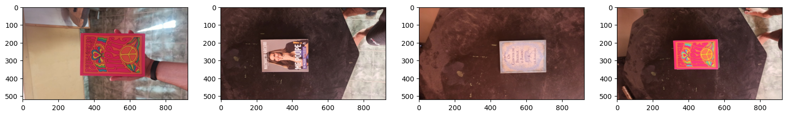
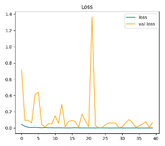
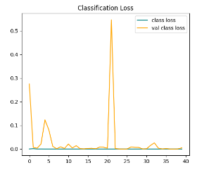
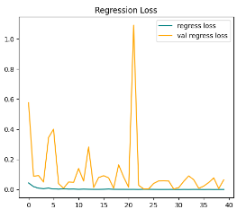
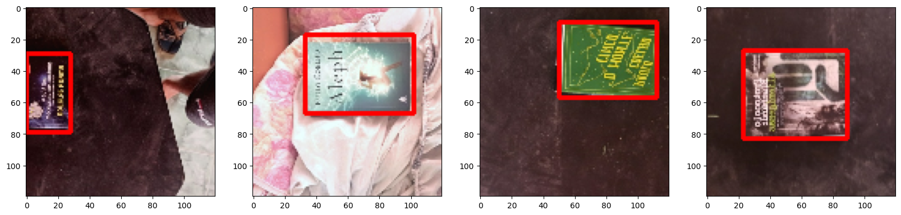
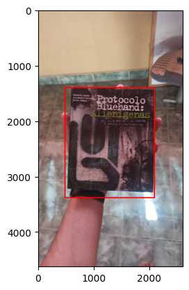
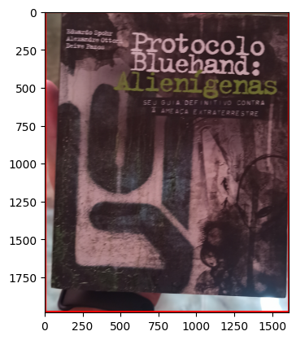
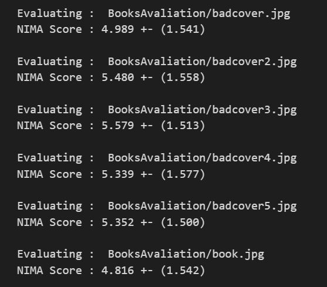
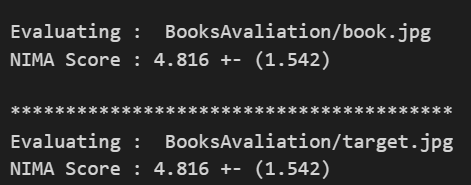

# Book Judge

**Sentiment Analysis algorithm to determine how good a book is judging only by its cover**

---

## Project Overview

The idea for this project was inspired by the well-known expression, *"Don't judge a book by its cover."* However, we often unconsciously do this. With this in mind, I decided to create an algorithm using machine learning to detect, crop, and reposition images of books. Then, using [NIMA (Neural Image Assessment)](https://arxiv.org/abs/1709.05424), the algorithm evaluates the quality of the book cover after proper image treatment.

*Sample photo used for training*

---

## Methodology

### Data Preparation

After gathering and labeling some images, I realized my dataset was smaller than desired. To address this, I used **data augmentation** to increase the dataset size without compromising model training or causing overfitting. This process expanded the dataset from 92 images to over 3,000 variations.

### Training

The images underwent two types of training:
1. **Classification**
2. **Regression**

I then selected the most suitable model for the project based on the results.

#### Training Results

*Graphs showing error reduction during training batches. Classification performed better than regression.*

---

## Results

### Book Detection

The algorithm successfully detected books within images. For example:

*The red square represents the detected book.*

### Real-Time Detection

For testing purposes, I ran the model on video streams captured with a webcam. The results were positive, successfully detecting books in real-time.

### Judgment

After further training and integrating the model with the NIMA algorithm, the "judgment" process was implemented. Below are the results:

*Judgment score (0-10).*

*Expected vs. actual predictions.*

---

## Observations

The algorithm performed well, particularly for elements that are visually distinct. Covers with blended elements or less defined shapes tended to receive lower scores.

### Future Improvements

1. **Enhanced Detection:** Extend detection capabilities to retrieve high-quality cover images through internet searches for better analysis.
2. **Artistic Judgment:** Incorporate artistic metrics, moving beyond pure aesthetics to include deeper artistic evaluations.

> *Note:* This project was developed in 2022 when AI tools were less accessible for everyday use. Current advancements could make these improvements more feasible.

---

